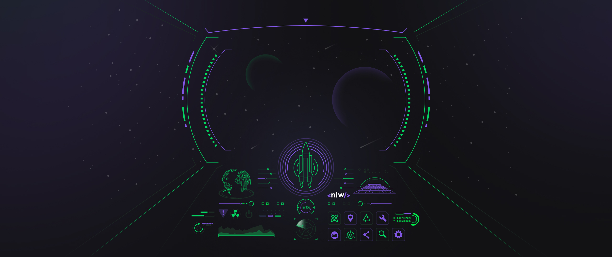

<html>
  <h1 align="center">Next Level Week 5</h1>
  

    
  

  
  ## :rocket: Tecnologias

<ul>
  <li>Flutter</li>
  <li>Mobx</li>
  <li>Share Plus</li>
</ul>

## :information_source: Sobre o projeto

<ul>
  Trata-se de um aplicativo de quiz desenvolvido durante a semana da NLW promovida pela RocketSeat. Este app tem por objetivo desafiar o usuário a responder perguntas sobre o ecossistema Flutte. 
  As perguntas estão armazenadas em um repositório do <a href="https://gist.githubusercontent.com/Ispx/8dcb7cd65602ade9ace9bab8a0531b04/raw/55b5d7ea09240a2cf5baa321227048b728aa44e6/quizzes.json">Gist</a> e são dividias em categorias e ao final de cada desafio o usuário pode compartilhar o resultado obtido em outros apps.
</ul>

## :information_source: Como rodar o projeto
<ul>
  <li><h5>Clone o projeto</h5></li>
  <li><h5>Abra o mesmo em uma IDE que de suporte ao Flutter</h5></li>
  <li><h5>Conecte seu dispositivo móvel na máquina e selecione o mesmo na IDE</h5></li>
  <li><h5>Rode o projeto</h5></li>
</ul>
